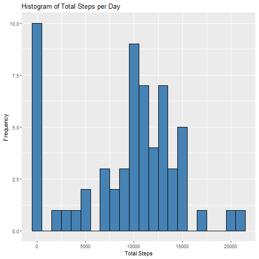
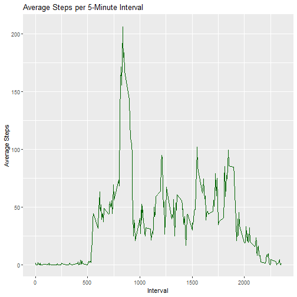
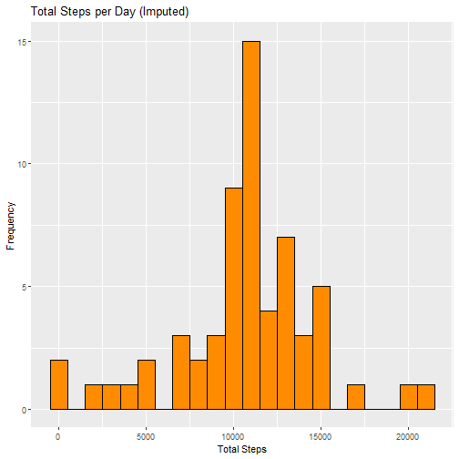
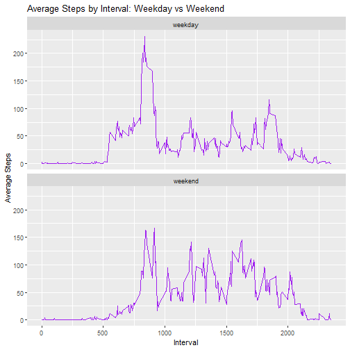

  


## Loading and preprocessing the data


``` r
data <- read.csv("activity.csv")
data$date <- as.Date(data$date)
```

## What is mean total number of steps taken per day?


``` r
total_steps_per_day <- data %>%
  group_by(date) %>%
  summarise(total_steps = sum(steps, na.rm = TRUE))

# Histogram
ggplot(total_steps_per_day, aes(x = total_steps)) +
  geom_histogram(binwidth = 1000, fill = "steelblue", color = "black") +
  labs(title = "Histogram of Total Steps per Day", x = "Total Steps", y = "Frequency")
```



``` r
# Mean and Median
mean_steps <- mean(total_steps_per_day$total_steps)
median_steps <- median(total_steps_per_day$total_steps)
mean_steps
```

```
## [1] 9354.23
```

``` r
median_steps
```

```
## [1] 10395
```

## What is the average daily activity pattern?


``` r
average_interval <- data %>%
  group_by(interval) %>%
  summarise(mean_steps = mean(steps, na.rm = TRUE))

# Time series plot
ggplot(average_interval, aes(x = interval, y = mean_steps)) +
  geom_line(color = "darkgreen") +
  labs(title = "Average Steps per 5-Minute Interval", x = "Interval", y = "Average Steps")
```



``` r
# Interval with max average steps
max_interval <- average_interval[which.max(average_interval$mean_steps), ]
max_interval
```

```
## # A tibble: 1 × 2
##   interval mean_steps
##      <int>      <dbl>
## 1      835       206.
```

## Imputing missing values


``` r
# Total number of missing values
missing_total <- sum(is.na(data$steps))
missing_total
```

```
## [1] 2304
```

``` r
# Impute with mean for that interval
impute_data <- data
impute_data$steps <- ifelse(is.na(impute_data$steps), 
                            ave(impute_data$steps, impute_data$interval, FUN = function(x) mean(x, na.rm = TRUE)), 
                            impute_data$steps)

# Histogram after imputation
total_steps_imputed <- impute_data %>%
  group_by(date) %>%
  summarise(total_steps = sum(steps))

ggplot(total_steps_imputed, aes(x = total_steps)) +
  geom_histogram(binwidth = 1000, fill = "darkorange", color = "black") +
  labs(title = "Total Steps per Day (Imputed)", x = "Total Steps", y = "Frequency")
```



``` r
# Mean and Median after imputation
mean_imputed <- mean(total_steps_imputed$total_steps)
median_imputed <- median(total_steps_imputed$total_steps)
mean_imputed
```

```
## [1] 10766.19
```

``` r
median_imputed
```

```
## [1] 10766.19
```

## Are there differences in activity patterns between weekdays and weekends?


``` r
impute_data$day_type <- ifelse(weekdays(impute_data$date) %in% c("Saturday", "Sunday"), "weekend", "weekday")
impute_data$day_type <- as.factor(impute_data$day_type)

average_by_daytype <- impute_data %>%
  group_by(interval, day_type) %>%
  summarise(mean_steps = mean(steps))
```

```
## `summarise()` has grouped output by 'interval'. You can override using the `.groups` argument.
```

``` r
# Panel plot
ggplot(average_by_daytype, aes(x = interval, y = mean_steps)) +
  geom_line(color = "purple") +
  facet_wrap(~ day_type, ncol = 1) +
  labs(title = "Average Steps by Interval: Weekday vs Weekend", x = "Interval", y = "Average Steps")
```



## Summary:
- Missing values were imputed using interval mean.
- Mean/median changed slightly.
- Weekends show different activity patterns compared to weekdays.

---
